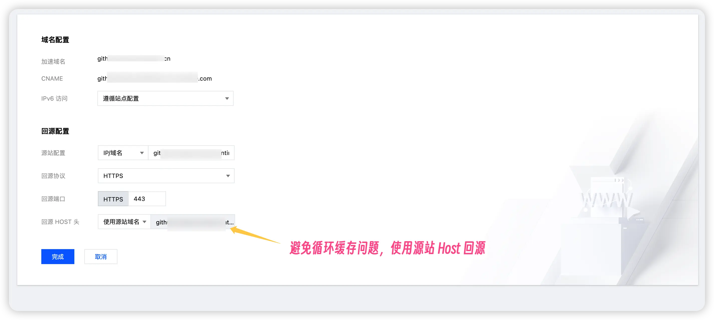
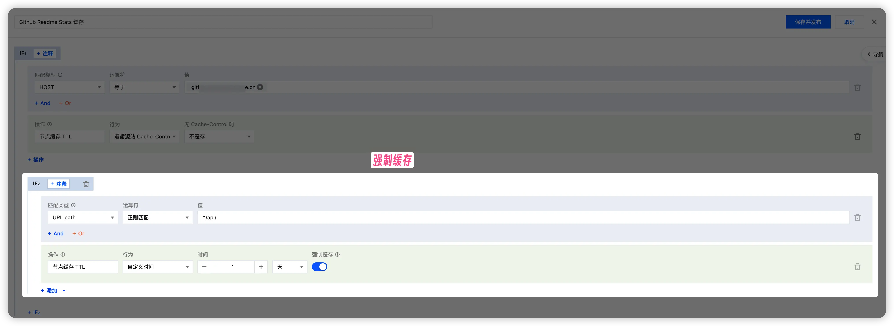

# GitHub Readme Stats - EdgeOne Pages 版本

本项目基于 [anuraghazra/github-readme-stats](https://github.com/anuraghazra/github-readme-stats) 核心代码，适配 [腾讯云 EdgeOne Pages](https://pages.edgeone.ai) 平台部署。

原项目采用 Vercel 平台部署，本版本专为 EdgeOne Pages 的 Node Functions 环境优化，提供相同的 API 接口和功能。

## 项目简介

- **动态统计卡片**：展示 GitHub 数据（如提交次数、PR、Star 等）
- **多种主题**：支持自定义颜色和布局
- **EdgeOne Pages 优化**：完美适配 EdgeOne Pages 部署环境
- **兼容原项目 API**：与原项目保持相同的查询参数和使用方式

## 快速开始

### 一键部署

您可以通过 [腾讯云 EdgeOne Pages](https://pages.edgeone.ai/zh) 一键部署。

直接点击此按钮一键部署：

[](https://console.cloud.tencent.com/edgeone/pages/new?repository-url=https%3A%2F%2Fgithub.com%2FMintimate%2Fgithub-readme-stats-eo)

查看 [腾讯云 EdgeOne Pages 文档](https://pages.edgeone.ai/zh/document/product-introduction) 了解更多详情。

> **注意**：需要设置环境变量 `PAT_1`，详见 [环境变量配置](#环境变量配置)。每次更改环境变量后需要重新触发部署使变量生效。

### 手动部署

1. **Fork 本仓库**
2. **配置环境变量**（详见下方[环境变量配置](#环境变量配置)）
3. **部署到 EdgeOne Pages**：
   - 参考下方的详细部署步骤

## 环境变量配置

本项目需要在 EdgeOne Pages 中配置以下环境变量：

### 必需环境变量

- **`PAT_1`**：GitHub 个人访问令牌（Personal Access Token）
  - 用于调用 GitHub API 获取用户统计数据
  - 获取方式见下方 [获取 GitHub Token](#获取-github-tokenclassic)
  - 支持配置多个 token（`PAT_1`、`PAT_2`、`PAT_3` 等）以提高速率限制

### 可选环境变量

- **`PREFERRED_ORIGIN`**：自定义域名前缀
  - 用于首页展示的 API 示例 URL
  - 例如：`https://github-readme-stats.mintimate.cn`
  - 如果不设置，将自动使用当前访问域名
- 其他原项目环境变量: [原项目文档](https://github.com/anuraghazra/github-readme-stats#customization)。

> **注意**：EdgeOne Pages 在部署后加载环境变量，每次更改环境变量后需要重新触发部署使变量生效。

## 当前已知限制

EdgeOne Pages 入口节点不支持按请求缓存，卡片接口默认会直接回源。建议在自定义域名前再套一层 CDN（如 EdgeOne CDN / Cloudflare）对静态响应做缓存，缓解 GitHub API 速率压力（还有请求次数的限制）。

比如: 我使用 EdgeOne 的站点加速，再次套娃 EdgeOne Pages，就可以实现缓存:



对应的缓存规则:



## 获取 GitHub Token（Classic）

1. 进入 [Account -> Settings -> Developer Settings -> Personal access tokens -> Tokens (classic)](https://github.com/settings/tokens)
2. 点击 `Generate new token -> Generate new token (classic)`
3. 勾选权限：
   - `repo`
   - `read:user`
4. 生成并复制 token（在 EdgeOne Pages 的环境变量中设置 `PAT_1` 等于这个 token 值）

## 部署到 EdgeOne Pages

1. 登录腾讯云 EdgeOne 控制台，创建新的 Pages 项目
2. 选择 GitHub 作为代码源并关联本仓库；或直接下载仓库后在 EdgeOne Pages 手动上传（会自动触发部署）
3. 在项目的环境变量中设置 `PAT_1` 为上一步获取的 GitHub Token
4. （可选）设置 `PREFERRED_ORIGIN` 环境变量以自定义首页展示的 URL 前缀
5. 由于 EdgeOne Pages 在部署后加载环境变量，设置完成后需要再次触发部署使变量生效

## 使用说明

部署完成后，访问您的 EdgeOne Pages 域名即可看到使用文档。API 接口与原项目完全兼容。

### 可用接口

- `/api` - GitHub 统计卡片
- `/api/top-langs` - 语言占比卡片
- `/api/pin` - 仓库卡片
- `/api/gist` - Gist 卡片
- `/api/wakatime` - WakaTime 统计卡片

详细参数请参考 [原项目文档](https://github.com/anuraghazra/github-readme-stats/blob/master/readme.md)。

## 示例卡片

将以下代码复制到你的 README 文件中（替换为您的域名和用户名）：

```md


```

更多样式和参数配置(环境变量)请参考 [原项目文档](https://github.com/anuraghazra/github-readme-stats#customization)。

## 相关链接

- [原项目仓库](https://github.com/anuraghazra/github-readme-stats) - anuraghazra/github-readme-stats
- [EdgeOne Pages 文档](https://pages.edgeone.ai/zh/document/product-introduction)
- [EdgeOne Pages 控制台](https://console.cloud.tencent.com/edgeone/pages)

## License

本项目基于原项目的 MIT 协议开源。详见 [LICENSE](LICENSE) 文件。
